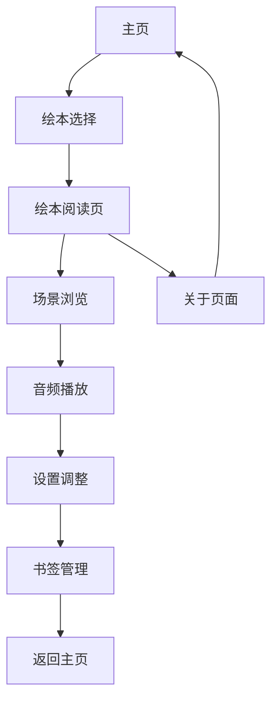

# Oscar绘本网站产品需求文档

## 1. 产品概述

Oscar是一个整合多个绘本故事的交互式数字阅读平台，为用户提供沉浸式的音频视觉阅读体验。

- 该平台整合现有的两个绘本项目（福尔摩斯探案故事和莫奈水莲画作故事），提供统一的浏览和阅读界面。
- 目标用户包括儿童、成人读者以及对交互式数字内容感兴趣的用户群体，通过多媒体形式提升阅读体验。

## 2. 核心功能

### 2.1 用户角色

本产品面向所有用户开放，无需注册即可使用全部功能。

### 2.2 功能模块

我们的Oscar绘本网站包含以下主要页面：

1. **主页**：绘本选择界面、导航菜单、平台介绍
2. **绘本阅读页**：场景展示、音频播放、进度控制、设置面板
3. **关于页面**：平台介绍、使用说明

### 2.3 页面详情

| 页面名称 | 模块名称 | 功能描述 |
|---------|---------|---------|
| 主页 | 绘本选择界面 | 展示可用绘本列表，包含封面图片、标题、简介，支持点击进入阅读 |
| 主页 | 导航菜单 | 提供页面导航、语言切换、全屏模式切换功能 |
| 主页 | 平台介绍 | 展示Oscar平台的特色和使用方法 |
| 绘本阅读页 | 场景展示 | 显示当前场景的图片、文字内容、引用语句 |
| 绘本阅读页 | 音频播放 | 播放场景对应的音频内容，支持播放/暂停、音量调节、静音功能 |
| 绘本阅读页 | 进度控制 | 显示阅读进度、支持场景切换、书签功能 |
| 绘本阅读页 | 设置面板 | 提供自动播放、音量设置、全屏模式、语言切换等选项 |
| 绘本阅读页 | 键盘导航 | 支持方向键、空格键、快捷键等键盘操作 |
| 关于页面 | 平台介绍 | 详细介绍Oscar平台的功能特色和技术特点 |
| 关于页面 | 使用说明 | 提供详细的操作指南和快捷键说明 |

## 3. 核心流程

**主要用户操作流程：**

用户访问Oscar网站主页 → 浏览可用绘本列表 → 选择感兴趣的绘本 → 进入绘本阅读界面 → 通过滚动、点击或键盘操作浏览场景 → 播放音频内容 → 调整设置（可选）→ 添加书签（可选）→ 完成阅读或返回主页选择其他绘本

## 4. 用户界面设计

### 4.1 设计风格

- **主色调**：深蓝色 (#1e3a8a) 和温暖的金色 (#f59e0b)，营造优雅的阅读氛围
- **按钮样式**：圆角设计，支持悬停效果和点击反馈
- **字体**：中文使用思源黑体，英文使用Inter字体，主要字号16px-24px
- **布局风格**：卡片式设计，响应式布局，支持全屏阅读模式
- **图标风格**：使用Lucide React图标库，简洁现代的线性图标

### 4.2 页面设计概览

| 页面名称 | 模块名称 | UI元素 |
|---------|---------|--------|
| 主页 | 绘本选择界面 | 网格布局的绘本卡片，包含封面图片、标题、描述文字，悬停效果，渐变背景 |
| 主页 | 导航菜单 | 顶部固定导航栏，包含Logo、菜单项、语言切换按钮，深色背景 |
| 绘本阅读页 | 场景展示 | 全屏图片背景，叠加文字内容，优雅的排版和阴影效果 |
| 绘本阅读页 | 音频控制 | 浮动音频控制面板，包含播放按钮、进度条、音量滑块，半透明背景 |
| 绘本阅读页 | 设置面板 | 侧边滑出面板，包含开关、滑块、按钮等控件，毛玻璃效果 |

### 4.3 响应式设计

产品采用移动优先的响应式设计，支持桌面端、平板和手机端访问，针对触摸操作进行优化，支持手势导航和触摸友好的界面元素。