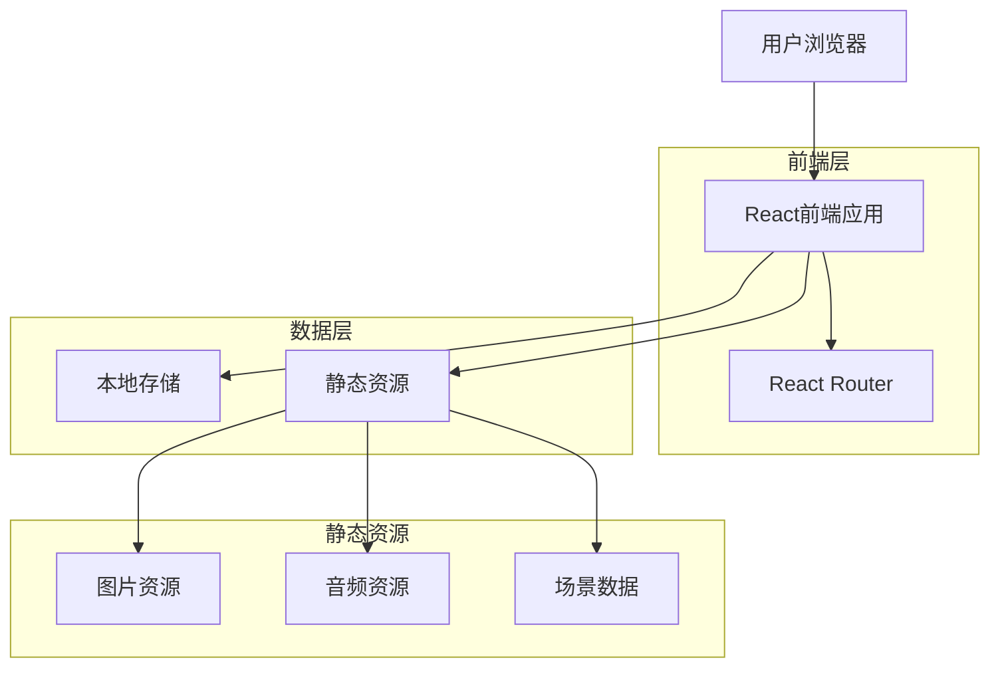
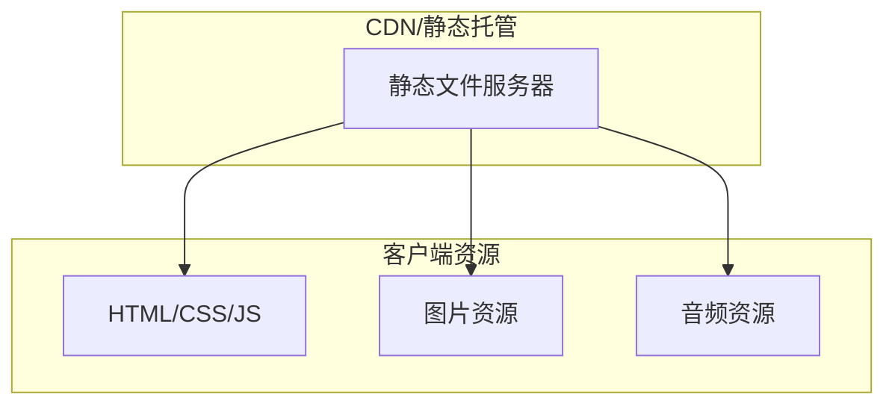
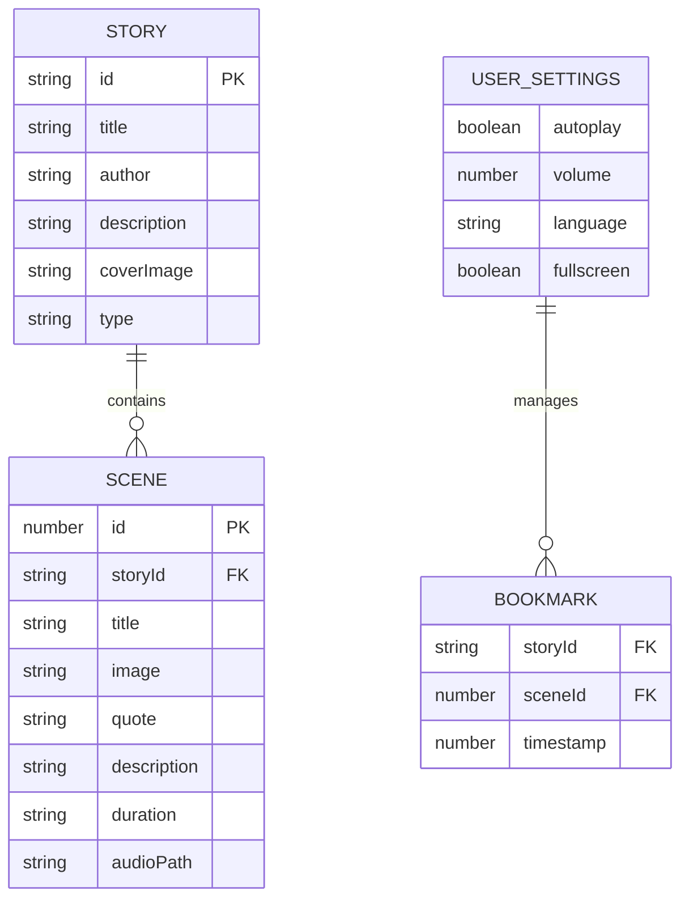

# Oscar绘本网站技术架构文档

## 1. 架构设计



## 2. 技术描述

* 前端：React\@18 + React Router\@6 + Tailwind CSS\@3 + Vite\@6

* 状态管理：React Hooks + Context API

* 音频处理：Web Audio API + HTML5 Audio

* 存储：LocalStorage（用户设置和书签）

## 3. 路由定义

| 路由              | 用途                |
| --------------- | ----------------- |
| /               | 主页，显示绘本选择界面和平台介绍  |
| /story/:storyId | 绘本阅读页，显示指定绘本的场景内容 |
| /about          | 关于页面，显示平台介绍和使用说明  |

## 4. API定义

### 4.1 核心数据结构

绘本数据结构

```typescript
interface Story {
  id: string;
  title: string;
  author: string;
  description: string;
  coverImage: string;
  scenes: Scene[];
}

interface Scene {
  id: number;
  title: string;
  image: string;
  quote: string;
  description?: string;
  duration?: string;
  audioPath: string;
}
```

用户设置数据结构

```typescript
interface UserSettings {
  autoplay: boolean;
  volume: number;
  language: 'en' | 'zh';
  fullscreen: boolean;
}

interface Bookmark {
  storyId: string;
  sceneId: number;
  timestamp: number;
}
```

### 4.2 本地存储API

用户设置管理

```javascript
// 保存用户设置
localStorage.setItem('oscar-settings', JSON.stringify(settings));

// 获取用户设置
const settings = JSON.parse(localStorage.getItem('oscar-settings') || '{}');
```

书签管理

```javascript
// 保存书签
localStorage.setItem('oscar-bookmarks', JSON.stringify(bookmarks));

// 获取书签
const bookmarks = JSON.parse(localStorage.getItem('oscar-bookmarks') || '[]');
```

## 5. 服务器架构图

本项目为纯前端应用，无需服务器端架构。所有功能通过客户端实现。



## 6. 数据模型

### 6.1 数据模型定义



### 6.2 数据定义语言

绘本数据文件结构

```javascript
// src/data/stories.js
export const stories = [
  {
    id: 'sherlock-holmes',
    title: 'A Study in Scarlet',
    author: 'Arthur Conan Doyle',
    description: '福尔摩斯探案系列的开篇之作',
    coverImage: '/imgs/sherlock-cover.jpg',
    type: 'detective',
    scenes: [
      // 复用 story-1 的场景数据
    ]
  },
  {
    id: 'monet-water-lilies',
    title: 'Water-Lilies - An Interactive Audio Tableau',
    author: 'Claude Monet',
    description: '莫奈水莲系列画作的交互式音频展示',
    coverImage: '/imgs/monet-cover.png',
    type: 'art',
    scenes: [
      // 复用 story-2 的场景数据
    ]
  }
];
```

用户设置初始化

```javascript
// src/utils/storage.js
export const defaultSettings = {
  autoplay: false,
  volume: 1.0,
  language: 'zh',
  fullscreen: false
};

export const saveSettings = (settings) => {
  localStorage.setItem('oscar-settings', JSON.stringify(settings));
};

export const loadSettings = () => {
  const saved = localStorage.getItem('oscar-settings');
  return saved ? { ...defaultSettings, ...JSON.parse(saved) } : defaultSettings;
};
```

